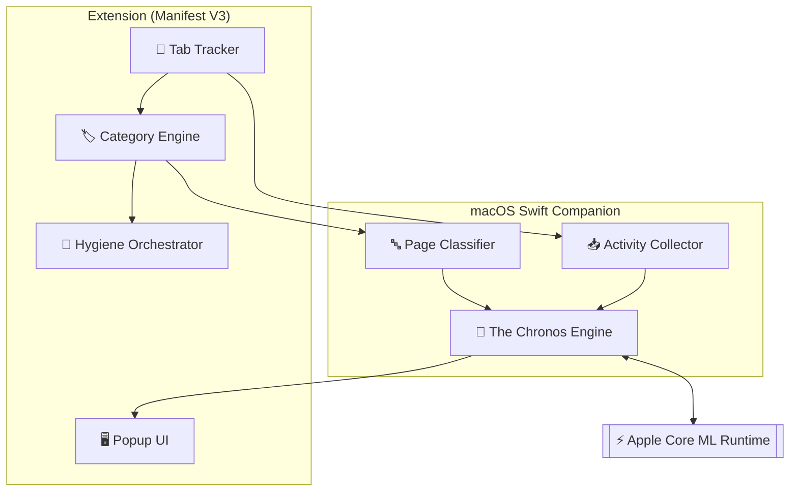

<div align="right">
  <sub>
    <strong>English</strong> |
    <a href="README_CN.md">中文</a>
  </sub>
</div>

# Neural-Janitor

### Edge-Accelerated Tab Hygiene powered by Apple Core ML.

Neural-Janitor is an intelligent Chrome/Edge extension that learns when to close your tabs. Unlike static timers, it uses a local Swift companion and Core ML to predict your idle state and learn your personal retention habits—all entirely on-device.

---

## ⚡ The Chronos Engine: How it Works

Neural-Janitor moves beyond simple timers by combining three local signals:

1.  **Manual Learning**: Learns your preferred "close-after" time for each category (AI, Work, Finance, etc.) based on your actual manual closure behavior.
2.  **Context Multiplier**: A Core ML model predicts your machine's idle windows. When you're likely away, it nudges cleanup to be more aggressive.
3.  **Tab Importance**: Scores tabs based on foreground dwell time, interaction count, and category priority (AI tools stay longer; Social fades fast).

<details>
<summary><b>View System Architecture (C4 Diagram)</b></summary>


</details>

---

## ✨ Key Features

- **Personalized Learning**: Automatically adapts closure thresholds per category and per domain (e.g., your specific broker vs. general finance).
- **AI-Driven Cleanup**: One-click "AI Clean" to reclaim memory and reduce tab count while protecting important work/AI sessions.
- **Smart Policies**:
    - **Whitelist**: Never close specific domains.
    - **Timed Blacklist**: Set fixed HH:MM limits for distracting sites (e.g., Social Media = 1h).
    - **Holiday Aware**: Supports Japan/China calendars to adapt behavior during weekends and holidays.
- **Privacy First**: 100% local. No cloud telemetry, no remote scripts, no data leaks.
- **Telemetry UI**: Real-time MEM/CPU monitoring and transparent "Closure Learning" statistics.

---

## 🛠️ Installation

1.  **Load Extension**:
    - Open `chrome://extensions`, enable **Developer Mode**.
    - Click **Load unpacked** and select the `extension/` folder.
    - Copy the **Extension ID**.

2.  **Link Companion**:
    ```bash
    chmod +x scripts/install.sh
    ./scripts/install.sh YOUR_EXTENSION_ID
    ```

3.  **Reload**: Reload the extension in the browser. The companion will start automatically.

---

## 📂 Data & Portability

Learned models and logs are stored at:
`~/Library/Application Support/Neural-Janitor/`

**Export/Import Model:**
```bash
# Export model only
./scripts/export_model_bundle.sh --output ~/Desktop

# Import on another Mac
./scripts/import_model_bundle.sh path/to/bundle.tar.gz
```

---

## 🏗️ Development

Verify JS syntax and build:
```bash
# Check extension logic
node --check extension/js/background.js
# Build Swift companion
swift build -c release --package-path companion/NeuralJanitorCompanion
```

<p align="center"><sub>Neural-Janitor — The Chronos Engine — Local Intelligence for a Cleaner Web.</sub></p>
