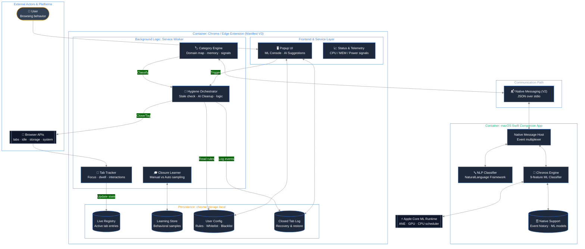

<div align="right">
  <sub>
    <strong>English</strong> |
    <a href="README_CN.md">中文</a>
  </sub>
</div>

# Neural-Janitor: Edge-Accelerated Tab Hygiene

## A local Core ML browser automation engine

Neural-Janitor is a Chrome / Edge tab management extension powered by Apple's local machine learning stack. It tracks lightweight browsing signals, learns how long different kinds of tabs should stay open, and uses a local Swift companion to add idle-window prediction and on-device page classification.

The core rule is simple:
**tab management should learn from the user, and that learning should stay entirely on-device.**

## Runtime Dataflow (C4 Container View)



The two execution contexts are intentionally split:
- **Browser context**: tracks focus, dwell, interactions, classification, and cleanup actions.
- **Native context**: handles local training, idle prediction, hardware telemetry, and NLP fallback classification.

## Why This Exists

Hardcoded timers are predictable, but they are also blunt. A tab that sat untouched for two days might still matter if it was a long research session; another might be disposable after ten minutes. Neural-Janitor treats close time as something to learn from your own behavior instead of something to hardcode once.

| Problem | Traditional Tab Closers | Neural-Janitor |
|:--|:--|:--|
| **When to close?** | Static timer such as 3 or 7 days. | Learned close time × tab importance, with real idle approval for automatic stale closure. |
| **Categorization** | Simple domain matching. | Domain map + page signals + local NLP fallback. |
| **Resource Cost** | Constant background polling. | Event-driven worker + local Core ML inference. |
| **Privacy** | Often cloud-backed. | 100% local. No telemetry leaves the device. |

## Current Feature Set

- **Test / Armed / Deploy modes**: Test mode is preview-only and locks AI Clean. Armed mode keeps Test behavior until learning is ready, then automatically enables Deploy. Deploy lets idle-approved scheduled cleanup and AI Clean close tabs and write to the closed-tab log.
- **Safe default**: Fresh installs start in Test mode. Deploy is locked while data is severely insufficient, can be armed once early close-time learning exists, and only activates when the readiness target is met.
- **Category-aware retention**: AI, work, finance, email, reference, social, entertainment, shopping, news, NSFW, and `Other` each have their own close-time cap.
- **Shared closure learning**: Real browser closes and popup closes sync into the companion so Chrome and Edge learn from the same closure database. The browser only keeps a tiny pending queue when the companion is offline.
- **Root-domain fallback learning**: Hard-to-classify sites can still get their own learned behavior instead of being mixed into one huge `Other` bucket.
- **Search-result learning**: SERP tabs use their own `Search Results` category and `search:<engine>` learning buckets, so they can be reclaimed without teaching unrelated Google/Bing/Yahoo pages to close early.
- **Holiday-aware idle predictions**: Japan and China calendars can widen or shift likely idle windows in the ML insights view.
- **AI Cleanup**: Prioritizes reducing tab count first, then bounded memory-pressure cleanup. In Deploy mode, manual AI Clean can also proactively trim a few clearly low-value tabs even when the machine is already under target, while still ranking by learned close-time pressure, engagement, and interaction count.
- **Transparent telemetry UI**: Memory, CPU, model readiness, closure learning, and idle-confidence state are shown directly in the popup.
- **Closed-tab recovery**: Tabs closed by the extension can be restored one-by-one or in batches. Restoring an auto-closed tab removes that auto-cleanup sample from learning.

## Category Closure Time Rules

Tabs are assigned a close time from four inputs: category defaults, learned manual-close behavior, root-domain history, and per-tab importance. Root-domain history wins over broad category history whenever it exists, so one fast-closing site does not teach the whole category to close early. Search result pages are isolated into `Search Results` and `search:<engine>` buckets. The Settings sliders are caps, not replacements; the model can close sooner, but it cannot keep a tab longer than the configured maximum.

| Category | Max Idle Time | Rationale |
|----------|--------------|-----------|
| **NSFW** | **12 hours** | Opened once, walked away. Close quickly. |
| Search Results | 12 hours | Disposable by default, then adapts from your SERP close behavior. |
| Social Media | 3 days | Fast-decaying value. |
| Entertainment | 5 days | Often revisit-able but not work-critical. |
| News | 5 days | Freshness matters. |
| Shopping | 7 days | Useful, but not indefinitely. |
| Other | 7 days | Conservative default for uncategorized pages. |
| Reference | 10 days | Documentation and articles often stay relevant. |
| Work & Productivity | 14 days | PRs, tickets, and drafts need time. |
| Email & Communication | 14 days | Session continuity can matter. |
| **Finance & Banking** | **30 days** | High-value sessions, but not permanent. |
| **AI Tools** | **30 days** | Long-running research and chat sessions are often intentional. |

## Architecture

### 1. Tab Interaction Tracker

The tracker records when a tab enters foreground, leaves foreground, how long it stayed there, and how often you interacted with it. Cleanup compares `now - lastBackgroundedAt` against an effective close time instead of relying on simple "opened at" age.

### 2. Manual Closure Learner

Manual closes are the primary signal. The learner stores category, root domain, foreground dwell, background age, and interactions, then recommends close times from meaningful manual samples. Domain-level patterns adapt first; category-level patterns require broader evidence across multiple domains. Automatic cleanup samples are kept as context only so the system does not train on its own decisions.

### 3. Local Page Classifier

The browser classifies pages with a domain map and content signals first. When confidence is low, the Swift companion uses Apple `NaturalLanguage` to score the page title, description, and text. The browser also keeps a small root-domain category memory so repeat sites do not keep falling back to `Other`.

### 4. Auxiliary Idle Predictor

The companion trains a 9-feature `TrainingSample` model from local activity history. That model is deliberately auxiliary: it influences idle-context multipliers and the ML console, while close-time learning remains the main decision source. Automatic stale closure waits for Chrome's real `idle` / `locked` state; a high model prior alone is not permission to close tabs while you are active.

### 5. Holiday-Aware Idle Windows

The browser sends per-day holiday levels for the next seven calendar dates to the companion. This lets a Monday holiday change Monday's prediction even if today is a normal workday. Workday and weekend/holiday sleep-wake windows act as priors, not hard cleanup rules.

### 6. Memory Pressure Cleanup

AI Cleanup scores tabs by learned close-time pressure, engagement, interaction count, and category as a weak tie-breaker. Lower-value, low-interaction, long-idle tabs are cleaned first. Test mode stays preview-only. When Deploy is active and you manually run AI Clean, the extension can still trim a small batch of obviously low-value background tabs.

## Security And Privacy

- **No cloud analytics**: Activity logs, models, and tab registries stay on the Mac and in extension local storage.
- **No remote tracking scripts**: The extension does not inject remote code or analytics pixels.
- **Local model only**: Core ML training and inference stay on-device.
- **Native Messaging boundary**: Browser JS and Swift communicate with length-prefixed local JSON over stdio.

## Setup Instructions

Native Messaging requires a native host manifest on macOS. Chrome / Edge cannot install that host silently, so a one-time install step is still required unless the companion is packaged as a signed installer.

### 1. Clone or open the repository

```bash
cd Neural-Janitor
```

### 2. Load the extension

Open `chrome://extensions` or `edge://extensions`, enable Developer Mode, choose **Load unpacked**, and select:

```text
extension/
```

Copy the extension ID shown by the browser.

### 3. Build and link the companion

```bash
chmod +x scripts/install.sh
./scripts/install.sh YOUR_EXTENSION_ID
```

Reload the extension afterward. The companion starts when the extension opens a Native Messaging connection.

### 4. After companion changes

If the Swift companion or native host metadata changes, rerun:

```bash
./scripts/install.sh YOUR_EXTENSION_ID
```

## Moving The Local Model Between Macs

Neural-Janitor stores learned artifacts in:

```text
~/Library/Application Support/Neural-Janitor/
```

Do not live-sync that folder through iCloud while the companion is running. Use the export/import scripts instead.

### Export on the source Mac

```bash
./scripts/export_model_bundle.sh --output ~/Desktop
```

To include raw activity history as well:

```bash
./scripts/export_model_bundle.sh --with-events --output ~/Desktop
```

### Import on the target Mac

Install Neural-Janitor first, then run:

```bash
./scripts/import_model_bundle.sh ~/Desktop/neural-janitor-model-bundle-YYYYMMDD-HHMMSS.tar.gz
```

To intentionally restore `activity_events.json` too:

```bash
./scripts/import_model_bundle.sh --with-events ~/Desktop/neural-janitor-model-bundle-YYYYMMDD-HHMMSS.tar.gz
```

The import script verifies checksums and backs up any existing local artifacts under:

```text
~/Library/Application Support/Neural-Janitor/backups/
```

Reload the browser extension after importing so the companion reloads the model.

## Using The Popup

- **Check**: Reviews stale tabs immediately and tags them without closing anything.
- **AI Clean**: Header cleanup reduces tab or memory pressure toward your targets. Suggestion-card trims are bounded separately as `Clean safest` and `Clean more`.
- **AI Suggestions**: Combines tab-count, memory, stale-tab, and low-importance signals into one cleanup decision card, while keeping Deploy/Test readiness separate.
- **Reset Model State**: Clears closure learning, domain-memory shortcuts, idle predictions, and the local companion artifacts.
- **MEM / CPU**: Shows current memory pressure, CPU usage, and compact CPU model / thread count.
- **ML Insights**: Shows idle windows for the next seven days with workday, weekend, or holiday labels.
- **Settings**: Controls companion usage, calendar selection, close-time caps, whitelist, timed blacklist, and AI Cleanup targets.

If you prefer the terminal, run:

```bash
scripts/reset_model_state.sh
```

## Development Checks

```bash
node --check extension/js/background.js
node --check extension/js/content.js
node --check extension/js/constants.js
node --check extension/js/categorizer.js
node --check extension/js/holidays.js
node --check extension/js/idle-detector.js
node --check extension/js/popup.js
node --check extension/js/storage.js
python3 -B -m py_compile scripts/train_model.py
bash -n scripts/install.sh
bash -n scripts/uninstall.sh
bash -n scripts/export_model_bundle.sh
bash -n scripts/import_model_bundle.sh
swift build -c release --package-path companion/NeuralJanitorCompanion
```

<p align="center"><sub>Neural-Janitor: Edge-Accelerated Tab Hygiene — The Chronos Engine</sub></p>
