<div align="right">
  <sub>
    <strong>English</strong> |
    <a href="README_CN.md">中文</a>
  </sub>
</div>

# Neural-Janitor: Edge-Accelerated Tab Hygiene

## A local Core ML browser automation engine

**Version**: 1.0 MVP  
**Author**: Leo  
**Date**: May 2026  

Neural-Janitor is an intelligent Chrome / Edge tab management extension powered by Apple's local machine learning stack. To the user, it is a smart cleanup tool; to the engineer, it is a methodology for capturing browser telemetry, compressing it locally, and using Core ML to predict user idle states without ever touching a cloud service.

Its architectural principle is simple:
**Tab management should learn from the user, but that learning must happen entirely on-device with near-zero power consumption.**

Underneath the browser extension, the system records lightweight behavioral signals. The macOS Swift companion app translates these into training data, and Core ML runs local predictions through Apple's runtime scheduler to identify the optimal moments for workspace hygiene.

## Runtime Dataflow (C4 Container View)

```mermaid
flowchart LR
  user(["Person<br/>Browser user"])

  subgraph browser["Container: Chrome / Edge Extension (Manifest V3)"]
    popup["Popup UI<br/>Modes, settings, ML console"]
    tracker["Tab Tracker<br/>Focus, dwell time, interactions"]
    category["Category Engine<br/>Domain map + local signals"]
    hygiene["Hygiene Orchestrator<br/>Check, AI Clean, test tags"]
    ipc["Native Messaging Client<br/>Protocol v2 JSON"]
    closedLog[("Closed Tab Log<br/>Restore records")]
    settings[("Local Settings<br/>Thresholds, calendar, whitelist")]
  end

  subgraph native["Container: macOS Swift Companion"]
    collector["Activity Collector<br/>Idle state + tab context"]
    classifier["Local Page Classifier<br/>NaturalLanguage scoring"]
    predictor["The Chronos Engine<br/>9-feature Core ML predictor"]
    artifacts[("Application Support<br/>Events, lookup, model metrics")]
  end

  coreml[["Apple Core ML Runtime<br/>ANE / GPU / CPU scheduler"]]
  chrome[["Chrome / Edge APIs<br/>tabs, idle, sessions, system"]]

  user -->|"Opens popup / changes settings"| popup
  chrome -->|"Tab, idle, session, MEM/CPU signals"| tracker
  popup -->|"Manual Check / AI Clean"| hygiene
  tracker --> category --> hygiene
  settings --> hygiene
  hygiene -->|"Close, tag, restore"| chrome
  hygiene --> closedLog
  tracker -->|"Activity samples"| ipc
  category -->|"Ambiguous page metadata"| ipc
  ipc <-->|"Native Messaging stdio"| collector
  ipc <-->|"Predictions, health, classification"| predictor
  collector --> artifacts
  artifacts --> predictor
  classifier --> predictor
  predictor --> coreml
  coreml -->|"Idle confidence curve"| predictor

  classDef person fill:#f9f2d7,stroke:#b59b3b,color:#2f2611,stroke-width:1px
  classDef browser fill:#e9f7ff,stroke:#2684b8,color:#102a3a,stroke-width:1.5px
  classDef native fill:#ecfdf3,stroke:#2f9d66,color:#123522,stroke-width:1.5px
  classDef data fill:#fff7ed,stroke:#d97706,color:#3a2206,stroke-width:1px
  classDef external fill:#f3f4f6,stroke:#6b7280,color:#1f2937,stroke-width:1px

  class user person
  class popup,tracker,category,hygiene,ipc browser
  class collector,classifier,predictor native
  class closedLog,settings,artifacts data
  class coreml,chrome external
```



This diagram separates the two execution contexts:
- **Browser Context**: Manifest V3 extension tracking tab focus, interaction, and content category.
- **Native Context**: Swift companion app handling model training, prediction, and local NLP classification.

## Why This Exists

Many modern browser tab managers rely on simple hardcoded timers (e.g., "close tabs after 3 days"). This is predictable but fundamentally flawed: a user might be actively using their computer but just not that specific tab, or they might be on a two-week vacation.

Neural-Janitor uses a narrower but smarter model role. It builds a `MLBoostedTreeClassifier` to predict when the user is actually away from the Mac. It only cleans tabs during predicted prolonged idle windows, ensuring you never return to a suddenly missing workspace.

| Problem | Traditional Tab Closers | The Neural-Janitor Pattern |
|:--|:--|:--|
| **When to close?** | Hardcoded static timer (e.g., 7 days). | Dynamic timer gated by Core ML idle prediction. |
| **Categorization** | Simple URL domain matching. | On-device NLP via Apple `NaturalLanguage` framework. |
| **Resource Cost** | Constant JavaScript polling in background. | Event-driven background worker + local Core ML inference. |
| **Privacy** | Often requires syncing data to the cloud. | 100% local. Zero telemetry leaves the device. |

## Current Feature Set

- **Test / Deploy modes**: Test mode learns your browsing pattern and tags tabs that would be closed. Deploy mode actually closes stale tabs and records them in the local closed-tab log.
- **Category-aware retention**: AI tools, work, finance, email, reference, social, entertainment, shopping, news, NSFW, and uncategorized pages each get their own default timeout. Every category threshold is adjustable in Settings with a slider and number input up to 30 days.
- **AI Tools category**: ChatGPT, Claude, Gemini, DeepSeek, Hugging Face, Perplexity, Qwen, Kimi, Doubao, and similar tools are classified separately and default to a 30-day retention window.
- **Holiday-aware idle predictions**: Settings can enable Japanese or Chinese holiday calendars. The ML Insights panel marks each predicted day as Workday, Weekend, or a named holiday / extended period such as Golden Week or National Day.
- **AI Cleanup**: The popup can close or tag low-importance tabs until memory pressure and tab count targets are met. It protects high-priority categories such as AI tools and work tabs, honors the whitelist, and respects Test mode.
- **Memory and CPU monitor**: The popup shows memory pressure, CPU usage, and a compact CPU model / thread label such as `M3 8T`.
- **AI Suggestions**: The popup recommends actions such as reducing tab count or running AI Cleanup. Suggestions refresh when you run Check, run AI Clean, change modes, change the holiday calendar, save settings, and periodically while the popup is open.
- **Transparent ML console**: The popup shows Native Messaging link state, real valid training samples, model accuracy when available, last local retrain time, hardware telemetry markers, decision confidence / heuristic estimates, and a low-power inference indicator.
- **Closed-tab recovery**: Tabs closed by Neural-Janitor are logged by category and can be restored from the Closed Log.

## Category Timeout Rules

Tabs are assigned an idle threshold based on their category. The browser uses a domain-first categorizer, and the companion app can help with local keyword heuristics and Natural Language tokenization. Thresholds are configurable in the popup Settings panel.

| Category | Max Idle Time | Rationale |
|----------|--------------|-----------|
| **NSFW** | **12 hours** | Opened once, walked away — close ASAP. Does not wait for idle window. |
| Social Media | 3 days | FOMO fades fast. |
| Entertainment | 5 days | Netflix tab from Tuesday? Gone. |
| News | 5 days | Stale news is no news. |
| Shopping | 7 days | Cart abandonment, but for tabs. |
| Other | 7 days | Default for uncategorized URLs. |
| Reference | 10 days | Stack Overflow answers age gracefully. |
| Work & Productivity | 14 days | PRs and Jira tickets need time. |
| Email & Communication | 14 days | Slack/Gmail may need session continuity. |
| **Finance & Banking** | **30 days** | Banking sessions are precious but not immortal. |
| **AI Tools** | **30 days** | Long-running research and chat sessions are often intentionally kept around. |

## Architecture

The system is split into two deployable artifacts:

1. **Manifest V3 Extension**: Handles browser tabs, injects content scripts for interaction tracking, manages the closed tab local registry, and communicates with the companion app via Native Messaging.
2. **Swift Companion App**: An invisible macOS daemon that aggregates the behavioral data, trains the local ML model, and serves predictions and page classifications.

### 1. Tab Interaction Tracker
Tracks `openedAt`, `lastVisited`, `dwellMs` (cumulative foreground time), and `interactions`. When a tab is closed, these metrics are preserved in a `chrome.sessions` bound log so it can be restored exactly as it was.

### 2. Local Page Classifier
When the extension cannot confidently categorize a URL, it asks the companion app. The companion uses the Apple `NaturalLanguage` framework to tokenize the page title, description, and content, scoring them against a weighted taxonomy.

### 3. Core ML Predictor
The companion builds a 9-feature `TrainingSample` from historical activity: day of week, hour, minute, weekend flag, minutes since last active, active events in the last 24 hours, active days in the last 7 days, tab count, and average dwell minutes. It trains a `MLBoostedTreeClassifier` and loads it through Core ML with `computeUnits = .all`.

Core ML can use the Apple Neural Engine, GPU, or CPU depending on macOS scheduling and model support. Public APIs expose requested compute units and hardware availability, not the exact processor used for each individual inference, so the UI reports **NPU/GPU eligibility and CPU fallback state** rather than pretending to know the private scheduler's exact choice.

### 4. Holiday-Aware Idle Windows
The browser builds a per-day `holidayLevels` payload for the next seven calendar dates and sends it to the companion through Native Messaging. That means a Monday Japanese holiday changes Monday's prediction even if today is a normal workday. If the native host is offline, the browser fallback uses the same Japan / China calendar module and labels the result as a heuristic estimate.

### 5. Memory Pressure Cleanup
AI Cleanup ranks tabs by category priority, interaction count, and idle age. Lower-value, low-interaction, long-idle tabs are cleaned first. NSFW tabs are always the most aggressive cleanup target; AI and work tabs are protected by high category priority. In Test mode, the same logic tags tabs instead of closing them.

## Security And Privacy

- **No Cloud Analytics**: All activity logs, ML models, and tab registries stay entirely on `~/Library/Application Support/Neural-Janitor/` and the extension's local storage.
- **Zero Tracker Injections**: Does not inject remote scripts or tracking pixels.
- **Local Model Only**: The Core ML model is trained exclusively on your machine, using your data.
- **Native Messaging Boundary**: Browser JS and Swift communicate through Chrome / Edge Native Messaging using local length-prefixed JSON over stdio.

## Transferable Pattern

The useful pattern is not just tab closing. It is:
**browser telemetry + local Swift companion + Core ML local inference**

This can transfer to:
- **Local Ad Blockers**: Train a model on your browsing habits to pre-emptively block dynamic tracking patterns.
- **Focus Agents**: Block distracting sites automatically during predicted deep-work periods.
- **Content Summarizers**: Offload heavy DOM parsing and summarization to native Swift rather than keeping V8 busy.

## Setup Instructions

Native Messaging requires a native host manifest on macOS. Chrome / Edge extensions cannot install that host silently, so a one-time install script is still required unless you package the companion as a signed installer.

### 1. Clone or Open the Repository

```bash
cd Neural-Janitor
```

### 2. Load the Extension
Open `chrome://extensions` or `edge://extensions`, enable Developer Mode, choose **Load unpacked**, and select:

```text
extension/
```

Copy the Extension ID shown by the browser.

### 3. Build and Link the Companion
```bash
chmod +x scripts/install.sh
./scripts/install.sh YOUR_EXTENSION_ID
```

Then reload the extension from the browser extensions page. The companion starts automatically when the extension opens a Native Messaging connection.

### 4. After Companion Changes
Whenever the Swift companion or Native Messaging host id changes, rerun:

```bash
./scripts/install.sh YOUR_EXTENSION_ID
```

Then reload the browser extension.

## Using The Popup

- **Check**: Runs a stale-tab check immediately. In Test mode it tags tabs; in Deploy mode it closes eligible tabs.
- **AI Clean**: Uses memory pressure, tab count targets, category priority, interaction count, idle age, and whitelist settings to decide what to clean.
- **MEM / CPU**: Shows current memory pressure, CPU usage, and compact CPU model / thread count.
- **AI Suggestions**: Shows current recommendations and action buttons.
- **ML Insights**: Shows idle windows for the next seven days, including holiday / weekend / workday labels.
- **Settings**: Controls companion usage, holiday calendar, per-category thresholds, whitelist, target memory pressure, target tab count, and forced AI Cleanup threshold.

## Development Checks

```bash
node --check extension/js/background.js
node --check extension/js/content.js
node --check extension/js/constants.js
node --check extension/js/categorizer.js
node --check extension/js/holidays.js
node --check extension/js/idle-detector.js
node --check extension/js/popup.js
node --check extension/js/storage.js
python3 -B -m py_compile scripts/train_model.py
bash -n scripts/install.sh
bash -n scripts/uninstall.sh
swift build -c release --package-path companion/NeuralJanitorCompanion
```

## Conclusion

Neural-Janitor tests an architectural stance: we don't need cloud LLMs for every intelligent feature. By combining Manifest V3's event-driven architecture with macOS's native ML capabilities, we can achieve context-aware automation that is private, performant, and deeply integrated into the operating system.

<p align="center"><sub>Neural-Janitor: Edge-Accelerated Tab Hygiene — The Chronos Engine</sub></p>
