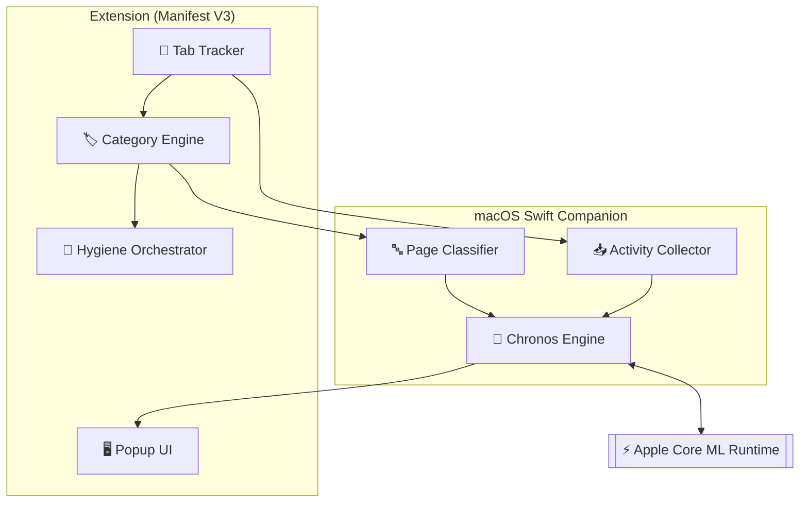

<div align="right">
  <sub>
    <strong>English</strong> |
    <a href="README_CN.md">中文</a>
  </sub>
</div>

# Neural-Janitor

### Edge-Accelerated Tab Hygiene powered by Apple Core ML

Neural-Janitor is an intelligent Chrome / Edge extension that learns when to close your tabs. Instead of static timers, it uses a local Swift companion and Core ML to predict idle windows and learn retention thresholds from your browsing habits, all on-device.

---

## ⚡ The Chronos Engine: How it Works

Neural-Janitor moves beyond simple timers by combining three local signals:

1.  **Manual Learning**: Learns retention time per category from your real manual closes.
2.  **Context Multipliers**: A Core ML model predicts idle windows. When you're likely away, cleanup becomes more assertive.
3.  **Tab Importance**: Scores tabs by foreground dwell, interaction count, and category priority.

<details>
<summary><b>View System Architecture (C4 Diagram)</b></summary>


</details>

---

## ✨ Key Features

-   **Personalized Learning**: Automatically adapts closure thresholds for each category and even specific root domains (e.g., your specific broker vs general finance).
-   **AI-Powered Cleanup**: One-click "AI Clean" to reclaim memory and reduce tab count while protecting critical Work and AI sessions.
-   **Smart Governance**:
    -   **Whitelist**: Domains that are never closed.
    -   **Timed Blacklist**: Set fixed numeric hour/minute limits for distracting sites (e.g., social media). These are excluded from learning.
    -   **Holiday Awareness**: Integrated JP/CN calendars to adjust behavior for weekends and named holidays.
-   **Privacy First**: 100% local. No cloud telemetry, no remote scripts, no data leaks.
-   **Telemetry Dashboard**: Real-time MEM/CPU monitoring and transparent closure-learning stats in the popup.

---

## 🛠️ Setup Instructions

1.  **Load the Extension**:
    -   Open `chrome://extensions`, enable **Developer Mode**.
    -   Click **Load unpacked** and select the `extension/` folder.
    -   Copy the **Extension ID**.

2.  **Link the Companion**:
    ```bash
    chmod +x scripts/install.sh
    ./scripts/install.sh YOUR_EXTENSION_ID
    ```

3.  **Reload**: Refresh the extension in your browser; the companion starts automatically.

---

## 📂 Data & Portability

Models and logs are stored in:
`~/Library/Application Support/Neural-Janitor/`

**Export/Import Models:**
```bash
# Export learned artifacts
./scripts/export_model_bundle.sh --output ~/Desktop

# Import on another Mac
./scripts/import_model_bundle.sh path/to/bundle.tar.gz
```

---

## 🏗️ Development

Verify JS syntax and build the companion:
```bash
# Check extension logic
node --check extension/js/background.js
# Build Swift companion
swift build -c release --package-path companion/NeuralJanitorCompanion
```

<p align="center"><sub>Neural-Janitor — Chronos Engine — Local intelligence for a cleaner web.</sub></p>
