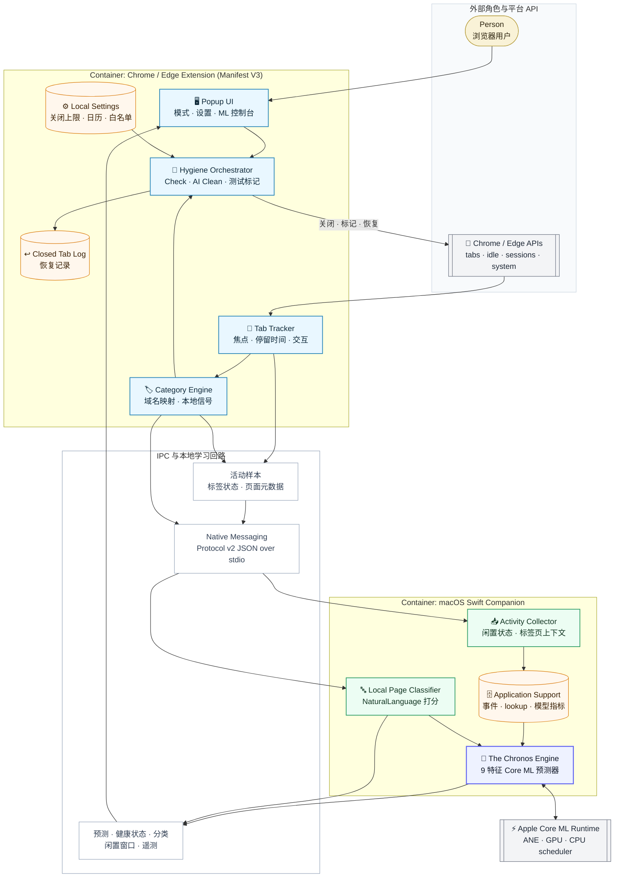

<div align="right">
  <sub>
    <a href="README.md">English</a> |
    <strong>中文</strong>
  </sub>
</div>

# Neural-Janitor：端侧加速的标签页自动化管理

## 一个本地化、Core ML 驱动的浏览器自动化引擎

**版本**：1.0 MVP  
**作者**：Leo  
**日期**：2026 年 5 月  

Neural-Janitor 是一个基于 Apple 本地机器学习栈的 Chrome / Edge 智能标签页管理扩展。用户看到的是一个聪明的标签页清理工具，但这篇文档真正讨论的是一套方法：如何捕捉浏览器行为遥测数据，在本地将其压缩，并利用 Core ML 预测用户的闲置状态，而绝不触碰任何云端服务。

它背后的工程原则很简单：
**标签页管理应该向用户学习，但这种学习必须完全在设备端发生，且几乎不消耗额外的电量。**

在浏览器扩展之下，系统记录轻量级的行为信号。macOS Swift 伴随程序将这些信号转化为训练数据，随后 Core ML 会通过 Apple 的本地运行时调度进行预测，以找到清理工作区的最佳时机。

## 运行时数据流（C4 Container View）



这张架构图把两个执行环境明确分开：
- **浏览器上下文**：Manifest V3 扩展，负责追踪标签页焦点、交互和内容分类。
- **原生上下文**：Swift 伴随程序（Companion App），处理模型训练、预测以及本地 NLP 分类。

## 为什么这样设计

许多现代浏览器标签页管理工具依赖简单的硬编码定时器（例如，“3天后关闭标签页”）。这很可预测，但也存在根本缺陷：用户可能正在积极使用电脑，只是没有查看那个特定的标签页；或者他们可能正在休两周的假。

Neural-Janitor 让模型承担了更聚焦的任务。它构建了一个 `MLBoostedTreeClassifier` 来预测用户何时真正离开 Mac。它只在预测的长期闲置窗口期间清理标签页，确保你回来时不会发现工作区突然消失。

| 痛点 | 传统的标签页清理工具 | Neural-Janitor 架构 |
|:--|:--|:--|
| **何时关闭？** | 硬编码的静态定时器（如 7 天）。 | 由 Core ML 闲置预测控制的动态定时器。 |
| **内容分类** | 简单的 URL 域名匹配。 | 基于 Apple `NaturalLanguage` 框架的设备端 NLP 分词。 |
| **资源消耗** | JavaScript 在后台持续轮询。 | 事件驱动的后台 Worker + 本地 Core ML 推理。 |
| **隐私安全** | 通常需要将数据同步到云端。 | 100% 本地运行。零遥测数据离开设备。 |

## 当前功能

- **测试 / 部署模式**：测试模式只学习你的浏览规律，并给“本来会被关闭”的标签页打标；部署模式会真正关闭过期标签页，并写入本地 Closed Log。
- **按类别保留标签页**：AI 工具、工作、金融、邮箱、参考资料、社交、娱乐、购物、新闻、NSFW 和未分类页面都有各自默认保留时间。Settings 里的滑块现在直接表示“关闭时间上限”，最高 30 天，旁边会同时显示当前机器学习 × 重要度倍率算出的关闭时间，以及最终实际使用的关闭时间。
- **手动关闭学习**：你在浏览器里直接关掉标签页，或者在插件 Popup 里使用 Close & Log，都会成为本地学习样本。Neural-Janitor 会同时学习前台停留时间和离开前台后的背景时间；自动清理样本只作为上下文记录，避免系统把自己的判断反复强化。
- **AI Tools 独立分类**：ChatGPT、Claude、Gemini、DeepSeek、Hugging Face、Perplexity、Qwen、Kimi、豆包等 AI 网页会进入单独类别，默认保留 30 天。
- **节假日感知的闲置预测**：Settings 可以选择日本或中国节假日日历。ML Insights 会把未来 7 天标为 Workday、Weekend 或具体节假日 / 长假区间，例如 Golden Week、国庆假期。
- **AI Cleanup**：插件可以根据内存压力、目标标签页数量、类别优先级、交互次数和闲置时间，自动关闭或标记低重要度标签页。它会保护 AI / 工作类标签页，遵守白名单，也会遵守测试模式。
- **MEM / CPU 监控**：Popup 会显示内存压力、CPU 占用，以及类似 `M3 8T` 的简短芯片 / 线程数标记。
- **AI Suggestions**：插件会给出减少标签页、运行 AI Cleanup、执行检查等建议。点击 Check、AI Clean、切换模式、切换节假日日历、保存设置，以及 Popup 保持打开时，建议都会刷新。
- **透明 ML 控制台**：Popup 会显示 Native Messaging 连接状态、真实有效训练样本、模型准确率、最后本地训练时间、硬件遥测标记、决策置信度 / 启发式估算，以及低功耗推理指示灯。
- **关闭标签页恢复**：由 Neural-Janitor 关闭的标签页会按类别记录，并可从 Closed Log 恢复。

## 分类关闭时间规则

标签页会根据分类、手动关闭学习结果和具体标签页的重要度得到一个关闭时间。Settings 里的滑块是用户允许的关闭时间上限：模型可以算出更短的实际关闭时间，但不能让标签页超过这个上限继续保留。下限由系统固定保护，避免用户同时调两个互相打架的值。

| 分类 | 最大闲置时间 | 理由 |
|----------|--------------|-----------|
| **NSFW** | **12 小时** | 随看随走，尽快关闭。不等闲置窗口。 |
| Social Media | 3 天 | 错失恐惧症（FOMO）消退得很快。 |
| Entertainment | 5 天 | 周二打开的 Netflix 标签页？关掉吧。 |
| News | 5 天 | 过时的新闻就不再是新闻了。 |
| Shopping | 7 天 | 购物车会被放弃，标签页也一样。 |
| Other | 7 天 | 未分类 URL 的默认值。 |
| Reference | 10 天 | Stack Overflow 的答案经得起时间考验。 |
| Work & Productivity | 14 天 | PR 和 Jira 任务需要时间处理。 |
| Email & Communication | 14 天 | Slack/Gmail 可能需要保持会话连续性。 |
| **Finance & Banking** | **30 天** | 银行会话很宝贵，但也不是永久的。 |
| **AI Tools** | **30 天** | 持续的研究和对话窗口通常是被刻意保留的。 |

## 系统架构

系统被拆分为两个可部署的组件：

1. **Manifest V3 Extension**：处理浏览器标签页，注入 content scripts 追踪交互，管理本地关闭标签页注册表，并通过 Native Messaging 与伴随程序通信。
2. **Swift Companion App**：一个不可见的 macOS 守护进程，负责聚合行为数据，训练本地 ML 模型，并提供闲置预测和页面分类。

### 1. 标签页交互追踪器 (Tab Interaction Tracker)
追踪器只是信号采集层，不直接决定是否关闭网页。它为每个标签页记录四类事实：什么时候进入前台、什么时候离开前台、累计前台停留多久、发生过多少交互。关闭判断用背景时钟（`now - lastBackgroundedAt`）对比一个合成后的有效关闭时间。前台 / 背景占比会被归一化成重要度倍率，并限制在 `0.75x..1.75x`，再乘以该类别从手动关闭行为学到的保留时间，最后再被用户设置的关闭时间上限截断。当前 active、pinned、audible 标签页在任何自动关闭前都会被保护。

### 2. 手动关闭学习器 (Manual Closure Learner)
浏览器中的真实关闭行为（`Ctrl+W` / 关闭按钮）和插件 Popup 里的关闭行为会被写入 `chrome.storage.local`，样本包含分类、前台停留时间、背景年龄、交互次数和关闭时间。学习从约 15 秒以上的短但真实样本开始，只需要 3 条有效手动关闭样本就能给出临时学习关闭时间。学习出的关闭时间优先使用有意义的手动背景年龄样本；如果用户经常在前台看完后直接关闭，则用前台停留时间作为 fallback。过期检查和 AI Cleanup 触发的程序化关闭会被显式排除出浏览器手动关闭路径，只作为自动清理上下文记录。

### 3. 本地页面分类器 (Local Page Classifier)
当扩展程序无法自信地对 URL 进行分类时，它会询问伴随程序。伴随程序使用 Apple `NaturalLanguage` 框架对网页标题、描述和内容进行分词，并对照加权分类法进行打分。

### 4. Core ML 预测器 (Core ML Predictor)
伴随程序从历史活动中构建一个包含 9 个特征的 `TrainingSample`：星期几、小时、分钟、是否周末、距离上次活跃多久、过去 24 小时活跃事件数、过去 7 天活跃天数、标签页数量、平均停留分钟数。它会训练一个 `MLBoostedTreeClassifier`，并通过 `computeUnits = .all` 加载到 Core ML。

Core ML 可能根据 macOS 调度和模型支持情况使用 Apple Neural Engine、GPU 或 CPU。公开 API 能告诉我们请求了哪些计算单元以及硬件是否可用，但不会暴露每一次推理到底跑在哪个处理器上。因此 UI 会展示 **Model / Learning / Fallback 状态**，而不会假装知道系统私有调度器的精确选择。

### 5. 节假日感知的闲置窗口
浏览器会为未来 7 个实际日期生成逐日 `holidayLevels`，并通过 Native Messaging 发给 Swift 伴随程序。这样即使今天不是假日，如果下周一是日本或中国假日，周一的预测也会被单独调整。Native host 离线时，浏览器 fallback 也会使用同一套日本 / 中国日历，并明确标记为启发式估算。

### 6. 内存压力清理
AI Cleanup 会综合类别优先级、交互次数和闲置时间为标签页排序。低价值、低交互、长时间闲置的标签页会优先被清理。NSFW 标签页最激进；AI 和工作类标签页会因为高优先级而被保护。在测试模式中，同样的逻辑只会打标，不会关闭标签页。

## 安全与隐私

- **无云端分析**：所有活动日志、ML 模型和标签页注册表都完全保留在 `~/Library/Application Support/Neural-Janitor/` 和扩展程序的本地存储中。
- **零追踪注入**：不注入远程脚本或追踪像素。
- **纯本地模型**：Core ML 模型完全在你的机器上使用你的数据进行训练。
- **Native Messaging 边界**：浏览器 JS 和 Swift 之间通过 Chrome / Edge Native Messaging 通信，本地 stdio 传输长度前缀 JSON。

## 可迁移的模式

这个项目真正可迁移的不仅仅是标签页清理，而是：
**浏览器遥测数据 + 本地 Swift 伴随程序 + Core ML 本地推理**

它可以迁移到：
- **本地广告拦截器**：根据你的浏览习惯训练模型，抢先拦截动态追踪模式。
- **专注代理**：在预测的深度工作时间段自动屏蔽干扰网站。
- **内容总结器**：将繁重的 DOM 解析和总结工作卸载给原生 Swift，而不是让 V8 引擎持续高负载。

## 安装指南

Native Messaging 需要在 macOS 上安装一个 native host manifest。Chrome / Edge 扩展不能静默安装这个 host，因此除非将伴随程序打包成签名安装器，否则一次性安装脚本仍然不可避免。

### 1. 克隆或打开仓库

```bash
cd Neural-Janitor
```

### 2. 加载扩展程序
打开 `chrome://extensions` 或 `edge://extensions`，启用 Developer Mode，点击 **Load unpacked**，选择：

```text
extension/
```

复制浏览器显示的 Extension ID。

### 3. 构建并链接伴随程序
```bash
chmod +x scripts/install.sh
./scripts/install.sh 你的_EXTENSION_ID
```

随后在扩展管理页面 reload 插件。伴随程序会在扩展建立 Native Messaging 连接时自动启动。

### 4. 伴随程序更新后
只要 Swift companion 或 Native Messaging host 配置发生变化，重新运行：

```bash
./scripts/install.sh 你的_EXTENSION_ID
```

然后在 Chrome / Edge 扩展页 reload 插件。

## 在多台 Mac 之间迁移本地模型

Neural-Janitor 学到的本地模型文件默认保存在：

```text
~/Library/Application Support/Neural-Janitor/
```

如果你想让另一台 Mac 使用同一套模型，不建议把整个目录直接放进 iCloud 实时同步。伴随程序运行时会持续写入活动数据，直接同步热目录容易出现冲突。更稳妥的方式是导出一个 snapshot 包，再在另一台 Mac 上导入。

### 会迁移哪些文件

导出脚本会打包可迁移的模型产物：

| 文件 | 用途 |
|------|------|
| `TabIdlePredictor.mlmodel` | 样本足够后生成的 Create ML / Core ML 闲置预测模型。 |
| `idle_lookup.json` | Core ML 模型尚未生成或不可用时的 CPU lookup fallback。 |
| `model_metrics.json` | 训练样本数、准确率、最后训练时间和运行时信息。 |
| `activity_events.json` | 可选的原始训练历史。只有加 `--with-events` 才会导出。 |

导出的包还会包含 `MANIFEST.md` 和 `SHA256SUMS`，目标 Mac 导入时会做校验。

### 在源 Mac 导出

推荐只导出模型产物：

```bash
./scripts/export_model_bundle.sh --output ~/Desktop
```

它会生成类似这样的文件：

```text
~/Desktop/neural-janitor-model-bundle-20260501-153000.tar.gz
```

如果你明确想连原始浏览活动历史一起迁移：

```bash
./scripts/export_model_bundle.sh --with-events --output ~/Desktop
```

然后用 AirDrop、iCloud Drive、U 盘或其他私密文件传输方式，把这个 `.tar.gz` 移到目标 Mac。

### 在目标 Mac 导入

先在目标 Mac 正常安装 Neural-Janitor：

```bash
./scripts/install.sh 你的_EXTENSION_ID
```

然后导入模型包：

```bash
./scripts/import_model_bundle.sh ~/Desktop/neural-janitor-model-bundle-20260501-153000.tar.gz
```

如果这个包里包含 `activity_events.json`，并且你确实想恢复原始训练历史：

```bash
./scripts/import_model_bundle.sh --with-events ~/Desktop/neural-janitor-model-bundle-20260501-153000.tar.gz
```

导入脚本会校验 checksum，并把目标 Mac 上已有的本地模型备份到：

```text
~/Library/Application Support/Neural-Janitor/backups/
```

导入后重启 Chrome / Edge，或者在扩展管理页 reload 插件，让 companion 重新加载模型。随后打开插件 Popup，确认 **Link: Connected**、**Model Samples**、**Closure Samples** 和 ML runtime label 正常显示。

## Popup 使用方式

- **Check**：立即检查过期标签页。测试模式下只打标，部署模式下会关闭符合条件的标签页。
- **AI Clean**：根据内存压力、目标标签页数量、类别优先级、交互次数、闲置时间和白名单决定清理目标。
- **MEM / CPU**：显示当前内存压力、CPU 占用和简短芯片 / 线程数。
- **AI Suggestions**：显示当前建议和可点击操作。
- **ML Insights**：显示未来 7 天的闲置窗口，并标注节假日 / 周末 / 工作日。
- **Settings**：控制 companion 使用、节假日日历、每个类别的关闭时间上限、白名单、目标内存压力、目标标签页数量和强制 AI Cleanup 阈值。

## 开发检查

```bash
node --check extension/js/background.js
node --check extension/js/content.js
node --check extension/js/constants.js
node --check extension/js/categorizer.js
node --check extension/js/holidays.js
node --check extension/js/idle-detector.js
node --check extension/js/popup.js
node --check extension/js/storage.js
python3 -B -m py_compile scripts/train_model.py
bash -n scripts/install.sh
bash -n scripts/uninstall.sh
bash -n scripts/export_model_bundle.sh
bash -n scripts/import_model_bundle.sh
swift build -c release --package-path companion/NeuralJanitorCompanion
```

## 结论

Neural-Janitor 测试了一个架构判断：我们不需要为每个智能功能都依赖云端 LLM。通过将 Manifest V3 的事件驱动架构与 macOS 的原生 ML 能力相结合，我们可以实现一种私密、高性能且深度集成到操作系统的上下文感知自动化管理。

<p align="center"><sub>Neural-Janitor: Edge-Accelerated Tab Hygiene — The Chronos Engine</sub></p>
