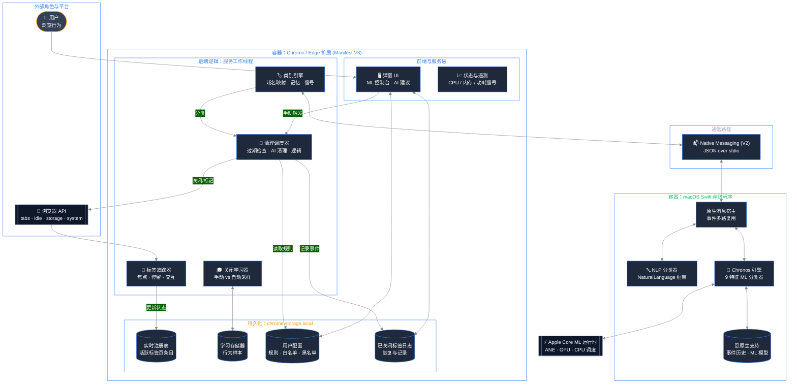

<div align="right">
  <sub>
    <a href="README.md">English</a> |
    <strong>中文</strong>
  </sub>
</div>

# Neural-Janitor：边缘加速的标签页卫生管理

## 一个本地 Core ML 浏览器自动化引擎

Neural-Janitor 是一款面向 Chrome / Edge 的标签页管理扩展，依托 Apple 本地机器学习栈运行。它会追踪轻量级浏览行为信号，学习不同类型标签页该保留多久，并通过一个本地 Swift 伴随程序补充闲置窗口预测和页面分类。

核心原则很简单：
**标签页管理应该从用户身上学习，而且这种学习必须完全留在设备端。**

## 运行时数据流（C4 容器视图）



两个执行上下文是刻意分开的：
- **浏览器上下文**：负责追踪焦点、停留时间、交互、分类和清理动作。
- **原生上下文**：负责本地训练、闲置预测、硬件遥测，以及 NLP 兜底分类。

## 为什么要做这件事

硬编码定时器很稳定，但也很钝。一个标签页如果两天没碰，也可能是长时间研究的一部分；另一个标签页，十分钟后就已经可以丢掉。Neural-Janitor 不把关闭时间当成固定常量，而是从你的实际行为里学习。

| 问题 | 传统标签页清理器 | Neural-Janitor |
|:--|:--|:--|
| **什么时候关闭？** | 3 天、7 天这类静态定时器。 | 学到的关闭时间 × 标签重要度，并用真实 idle/locked 状态给自动关闭放行。 |
| **分类方式** | 简单域名匹配。 | 域名映射 + 页面信号 + 本地 NLP 兜底。 |
| **资源消耗** | 后台持续轮询。 | 事件驱动 Worker + 本地 Core ML 推理。 |
| **隐私** | 经常需要云端同步。 | 100% 本地运行，不向外发送遥测。 |

## 当前功能

- **Test / Armed / Deploy 模式**：Test 只做预览并锁住 AI Clean；Armed 会保持 Test 行为，等学习数据达标后自动切到 Deploy；Deploy 允许 idle 放行后的定时清理和 AI Clean 真正关闭标签页并写入日志。
- **安全默认**：新安装默认先处于 Test。数据严重不足时 Deploy 会锁住；有早期关闭时间学习后可以先 Armed；达到 readiness 目标后才会真正 Deploy。
- **按类别保留**：AI、工作、金融、邮箱、参考、社交、娱乐、购物、新闻、NSFW 和 `Other` 都有自己的关闭上限。
- **共享关闭学习**：真实浏览器关闭和 Popup 里的关闭行为会同步进 companion，让 Chrome 和 Edge 共用同一份关闭学习数据库。浏览器本地只保留很小的离线暂存队列。
- **根域名兜底学习**：难以分类的网站也能按根域名学到自己的行为，不会全挤进一个巨大的 `Other` 桶。
- **搜索结果学习**：搜索结果页会进入单独的 `Search Results` 类别和 `search:<engine>` 学习桶，可以被回收，但不会教坏 Google/Bing/Yahoo 下的其他页面。
- **节假日感知的闲置预测**：可接入日本和中国日历，在 ML Insights 里调整可能的闲置窗口。
- **AI Cleanup**：优先减少标签页数量，再做受限的内存压力清理。只有在 Deploy 生效时，手动点 AI Clean 才会主动 trim 一小批明显低价值的后台标签页；Test 模式仍然只做预览，同时仍按学到的关闭压力、参与度和交互次数来排序。
- **透明遥测界面**：内存、CPU、模型成熟度、关闭学习和 idle 置信度都会直接显示在弹窗里。
- **已关闭标签页恢复**：扩展关闭的标签页可以单个恢复，也可以批量恢复。恢复自动关闭的页面会撤销对应的 auto-cleanup 学习样本。

## 分类关闭时间规则

标签页的关闭时间由四部分决定：类别默认值、手动关闭学习、根域名历史和单个标签页的重要度。只要某个根域名已经学到自己的关闭时间，它会优先于宽泛的大类经验，避免一个网站把整个类别带偏。搜索结果页会被隔离进 `Search Results` 和 `search:<engine>` 学习桶。设置里的滑块只是上限，不是替换；模型可以更早关闭，但不会超过你设定的最大值。

| 分类 | 最大闲置时间 | 说明 |
|----------|--------------|------|
| **NSFW** | **12 小时** | 打开一次就走，不等闲置窗口。 |
| Search Results | 12 小时 | 默认就是偏一次性的页面，之后会按你的 SERP 关闭习惯适应。 |
| Social Media | 3 天 | 价值衰减很快。 |
| Entertainment | 5 天 | 常回看，但通常不是工作核心。 |
| News | 5 天 | 新鲜度很重要。 |
| Shopping | 7 天 | 有用，但不该无限期保留。 |
| Other | 7 天 | 未分类页面的保守默认值。 |
| Reference | 10 天 | 文档和文章往往还能继续参考。 |
| Work & Productivity | 14 天 | PR、工单和草稿需要时间。 |
| Email & Communication | 14 天 | 会话连续性有时很重要。 |
| **Finance & Banking** | **30 天** | 高价值会话，但不是永久的。 |
| **AI Tools** | **30 天** | 长时间的研究和对话窗口通常是有意保留的。 |

## 架构

### 1. 标签页交互追踪器

追踪器记录标签页什么时候进入前台、什么时候离开前台、在前台停留了多久，以及交互了多少次。清理时比较的是 `now - lastBackgroundedAt`，而不是单纯看“打开多久了”。

### 2. 手动关闭学习器

手动关闭是主信号。学习器会保存分类、根域名、前台停留、后台年龄和交互次数，再从有意义的手动样本中推荐关闭时间。根域名模式会先适应；类别级模式需要更多、跨多个域名的证据。自动清理样本只作为上下文记录，不会拿来反过来训练系统自己。

### 3. 本地页面分类器

浏览器先用域名映射和页面信号进行分类。置信度不高时，Swift 伴随程序会用 Apple `NaturalLanguage` 对标题、描述和正文打分。浏览器侧还会保留一个很小的根域名分类记忆，让重复站点不要一直掉回 `Other`。

### 4. 辅助闲置预测器

伴随程序会从本地活动历史训练一个 9 特征的 `TrainingSample` 模型。这个模型是辅助角色：它影响闲置情境倍率和 ML 控制台，而真正的主学习器仍然是关闭时间学习。自动 stale 关闭等待 Chrome 真实报告 `idle` / `locked`；单独一个很高的模型先验不会在你仍然 active 时关闭标签页。

### 5. 节假日感知闲置窗口

浏览器会把未来七个自然日的节假日等级发送给伴随程序。这样即使今天不是假日，周一如果是日本或中国节假日，周一的预测也会单独变化。工作日和周末/假期的睡眠窗口只是先验，不是硬性清理规则。

### 6. 内存压力清理

AI Cleanup 会按照学到的关闭压力、参与度、交互次数和类别做弱权重排序。低价值、低交互、长时间闲置的标签页优先被清理。Test 模式只做预览，不会真正关闭。Deploy 生效后，手动触发 AI Clean 时，即使当前还没到压力阈值，也可以主动清掉一小批明显不重要的后台标签页。

## 安全与隐私

- **没有云端分析**：活动日志、模型和标签页注册表都保留在本机和扩展本地存储中。
- **没有远程追踪脚本**：扩展不会注入远程代码或分析像素。
- **纯本地模型**：Core ML 训练和推理都在设备上完成。
- **Native Messaging 边界**：浏览器 JS 和 Swift 通过长度前缀的本地 JSON over stdio 通信。

## 安装指南

Native Messaging 需要在 macOS 上安装一个 native host manifest。Chrome / Edge 不能静默安装这个 host，所以仍然需要一次性的安装步骤，除非把伴随程序打包成签名安装器。

### 1. 克隆或打开仓库

```bash
cd Neural-Janitor
```

### 2. 加载扩展

打开 `chrome://extensions` 或 `edge://extensions`，启用 Developer Mode，选择 **Load unpacked**，然后选中：

```text
extension/
```

复制浏览器显示的 Extension ID。

### 3. 构建并链接伴随程序

```bash
chmod +x scripts/install.sh
./scripts/install.sh YOUR_CHROME_EXTENSION_ID [YOUR_EDGE_EXTENSION_ID]
```

之后重新加载扩展。扩展发起 Native Messaging 连接时，伴随程序会自动启动。
如果 Chrome 和 Edge 的扩展 ID 不一样，就把两个 ID 都传给脚本，这样 native host manifest 会同时允许两边。

### 4. 伴随程序变化后

如果 Swift 伴随程序或 native host 元数据变化了，再运行一次：

```bash
./scripts/install.sh YOUR_CHROME_EXTENSION_ID [YOUR_EDGE_EXTENSION_ID]
```

## 在多台 Mac 之间迁移本地模型

Neural-Janitor 的学习成果保存在：

```text
~/Library/Application Support/Neural-Janitor/
```

不要在伴随程序运行时用 iCloud 直接同步这个目录。请改用导出 / 导入脚本。

### 在源 Mac 上导出

```bash
./scripts/export_model_bundle.sh --output ~/Desktop
```

如果你还想连原始活动历史一起迁移：

```bash
./scripts/export_model_bundle.sh --with-events --output ~/Desktop
```

### 在目标 Mac 上导入

先正常安装 Neural-Janitor，再执行：

```bash
./scripts/import_model_bundle.sh ~/Desktop/neural-janitor-model-bundle-YYYYMMDD-HHMMSS.tar.gz
```

如果你故意想恢复 `activity_events.json`：

```bash
./scripts/import_model_bundle.sh --with-events ~/Desktop/neural-janitor-model-bundle-YYYYMMDD-HHMMSS.tar.gz
```

导入脚本会校验 checksum，并把旧文件备份到：

```text
~/Library/Application Support/Neural-Janitor/backups/
```

导入后重新加载浏览器扩展，让伴随程序重新载入模型。

## 弹窗怎么用

- **Check**：立刻预览 stale 标签页并打标，不会关闭任何页面。
- **AI Clean**：顶部按钮用于把标签页数量或内存压力压回目标；AI Suggestions 里的 `Clean safest` / `Clean more` 是单独限量的小批量清理。
- **MEM / CPU**：显示当前内存压力、CPU 占用，以及简短的 CPU 型号 / 线程数。
- **ML Insights**：显示未来七天的闲置窗口，包含工作日、周末或节假日标签。
- **Settings**：控制是否使用伴随程序、日历选择、关闭时间上限、白名单、定时黑名单和 AI Cleanup 目标。
- **AI Suggestions**：把标签页数量、内存压力、stale 页面和低重要度页面合成一张清理判断卡；Deploy/Test 就绪状态会单独显示。
- **Reset Model State**：清空关闭学习、域名记忆、idle 预测和本地 companion 学习文件。

如果你更习惯命令行，直接运行：

```bash
scripts/reset_model_state.sh
```

## 开发检查

```bash
node --check extension/js/background.js
node --check extension/js/content.js
node --check extension/js/constants.js
node --check extension/js/categorizer.js
node --check extension/js/holidays.js
node --check extension/js/idle-detector.js
node --check extension/js/popup.js
node --check extension/js/storage.js
python3 -B -m py_compile scripts/train_model.py
bash -n scripts/install.sh
bash -n scripts/uninstall.sh
bash -n scripts/export_model_bundle.sh
bash -n scripts/import_model_bundle.sh
swift build -c release --package-path companion/NeuralJanitorCompanion
```

<p align="center"><sub>Neural-Janitor：边缘加速的标签页卫生管理 —— Chronos 引擎</sub></p>
